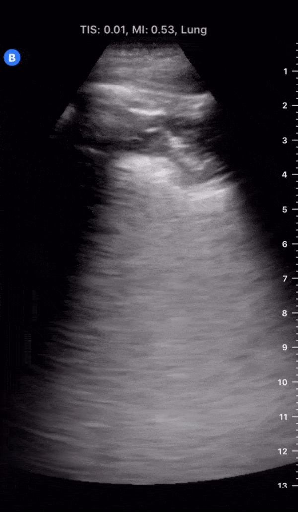
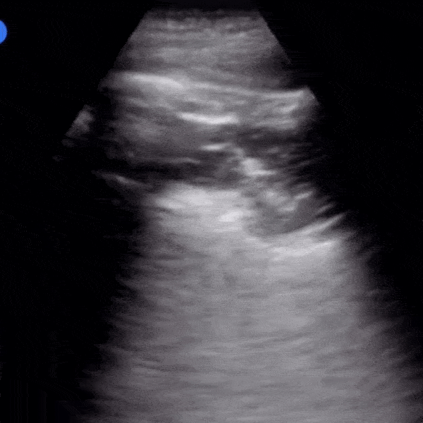
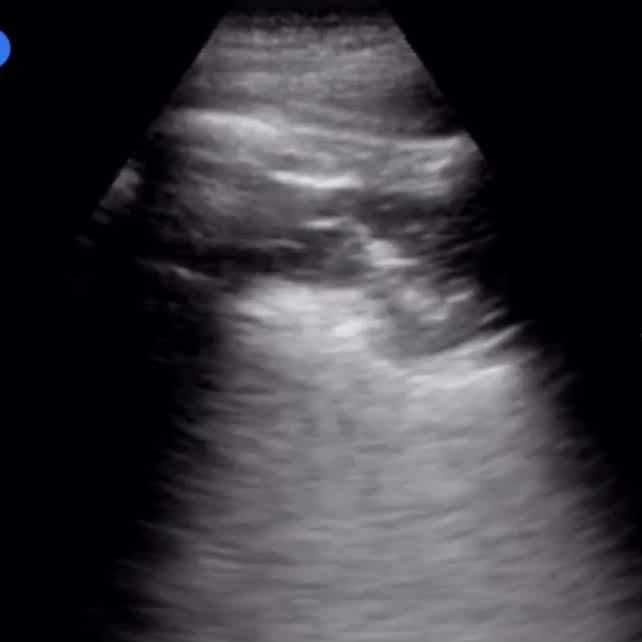
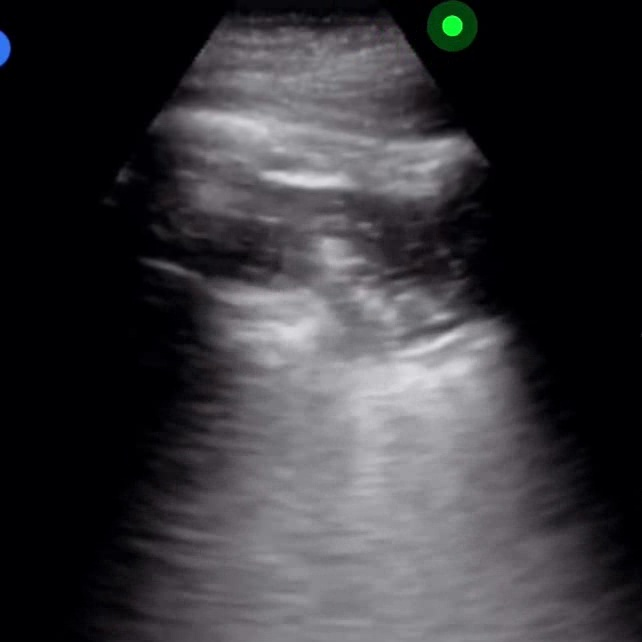

# COVID-US: An Open-Source Open-Access Initiative

The COVID-19 pandemic continues to have a devastating effect on the health and well-being of the global population. Apart from the global health crises, the pandemic has also caused significant economic and financial difficulties and socio-physiological implications. Effective screening, prognosis, and treatment planning plays a key role in controlling the pandemic. A few recent studies highlighted the role of point-of-care ultrasound imaging for COVID-19 screening and prognosis, particularly given its non-invasive nature, widespread global accessibility and availability, and easy-to-sanitize nature.  Motivated by this and the promise of artificial intelligence tools to aid clinicians, we introduce COVIDx-US, an open-access benchmark dataset of COVID-19 related ultrasound imaging data that is the largest of its kind. The COVIDx-US dataset was curated from multiple sources and consists of 80 lung ultrasound videos and 8,549 processed images of patients infected with SARS-CoV-2 pneumonia, non-SARS-CoV-2 pneumonia, as well as healthy control cases. The dataset was systematically processed and validated specifically for the purpose of building and evaluating artificial intelligence algorithms and models. 

Our goal is to encourage broad adoption and contribution to this project. Accordingly this project has been licensed under the __GNU Affero General Public License 3.0__. Please see license file for terms. 

**Update 01/28/2021:** We released the COVIDx-US (version 1.0) dataset with 80 ultrasound videos and 8,549 processed ultrasound images.\

The current COVIDx-US dataset is constructed from the following open source datasets:
* [ButterflyNetwork](https://www.butterflynetwork.com/)
* [GrepMed](https://www.grepmed.com/)
* [The POCUS Atlas](https://www.thepocusatlas.com/)
* [LITFL](https://litfl.com/)   

If there are any technical questions after the README, FAQ, and past/current issues have been read, please post an issue or contact:

* ashkan.ebadi@nrc-cnrc.gc.ca
* pengcheng.xi@nrc-cnrc.gc.ca
* alexander.wong@uwaterloo.ca
* alex.maclean@uwaterloo.ca

Conceptual flow of the data collection and processing flow
:-------------------------:

US video of a COVID-19 patient             |  Cropped video             |  First frame             |  First frame mask             |  Frame-67             |  Frame-67 mask
:-------------------------:|:-------------------------:|:-------------------------:|:-------------------------:|:-------------------------:|:-------------------------:
  |    |    |    |    |  

# Core COVID-US Team
1. National Research Council Canada
    * Ashkan Ebadi
    * Pengcheng Xi
    * Stephane Tremblay
    * Patrick Paul
2. Vision and Image Processing Research Group, University of Waterloo, Canada
    * Alexander Wong
    * Alex MacLean

# Requirements
To generate the __COVIDx-US dataset__:
* Python >=3.6
* Pandas >=1.1.3
* BeautifulSoup
* selenium >=3.141.0
* requests >=2.24.0
* zipfile
* Jupyter

# How to Generate the COVIDx-US Dataset?
1. Use create_COVIDxUS.ipynb to extract the ultrasound videos from multiple sources and integrate them in the COVIDx-US dataset. 
    * __Note:__ Make sure to modify the file paths in the code to your own paths, if reuqired.

# COVIDx-US Data Distribution
Ultrasound __videos__ distribution per label and probe type

Class | Convex | Linear | Total
--- | --- | --- | ---
__COVID-19__ | 39 | 7 | `46`
__Pneumonia__ | 20 | 4 | `24`
__Normal__ | 7 | 3 | `10`

Ultrasound __videos__ distribution per label and data source

Class | ButterflyNetwork | PocusAtlas | GrepMed | LITFL | Total
--- | --- | --- | --- | --- | ---
__COVID-19__ | 20 | 18 | 8 | 0 | `46`
__Pneumonia__ | 0 | 9 | 9 | 6 | `24`
__Normal__ | 2 | 5 | 3 | 0 | `10`
